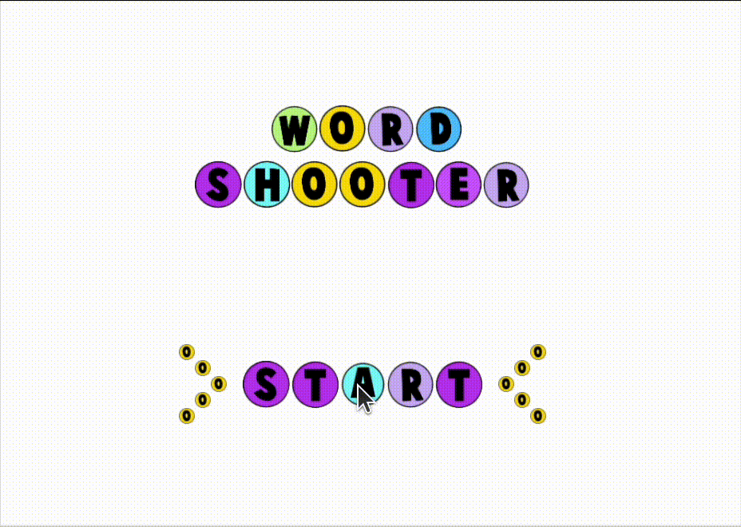

# Word Shooter

**Word Shooter** is a yet challenging game where players shoot words to earn points. Built with C++ and designed to challenge your speed and accuracy, this game is perfect for anyone who loves coding and gaming!

---

## Table of Contents
1. [Features](#features)
2. [Setup Instructions](#setup-instructions)
3. [How to Play](#how-to-play)
4. [Gameplay preview](#gameplay-preview)

---

## Features
- Dynamic random letter generation.
- Real-time scoring system.
- Multidirectional word-checking (horizontal, vertical, diagonal).
- User-friendly home page.

---

## Setup Instructions
### Prerequisites
- Linux (Ubuntu recommended).
- C++ compiler (G++).
- Libraries:
  - FreeGLUT
  - GLEW
  - SDL

### Steps
1. Clone the repository:
   
bash
   sudo apt-get install freeglut3-dev glew-utils libglew1.6-dev libfreeimage-dev
   # Alternative (if above doesn't work):
   sudo apt-get install freeglut3-dev glew-utils libglew-dev libfreeimage-dev
    
   cd word_shooter
   make clean
   make
   ./word-shooter

## How to Play
1. At the start of the game:
   - Two rows of random letters are generated.
   - Words are checked and popped until either no valid words remain or four words are made.
   
2. Players control a shooter ball with a randomly generated letter:
   - On collision, the ball checks all four directions for possible words.
   - Words must have a minimum length of three letters.

3. Scoring:
   - Points are awarded based on the number of letters in the formed word.
   - Play for a total of **150 seconds** and aim for the highest score.

## Gameplay Preview

