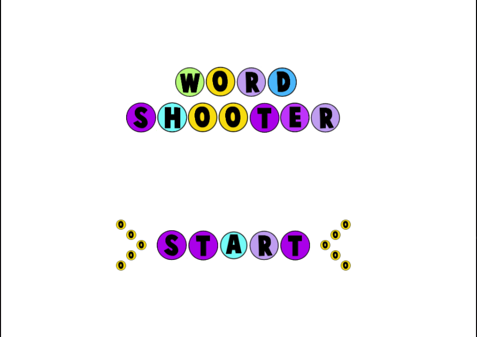

# WORD SHOOTER

#### Video Demo: https://youtu.be/pi8gFPJi6Co



**Word Shooter** is a yet challenging game where players shoot words to earn points. Built with C++ and designed to challenge your speed and accuracy, this game is perfect for anyone who loves coding and gaming!

---

## Table of Contents
1. [Features](#features)
2. [Setup Instructions](#setup-instructions)
3. [How to Play](#how-to-play)
5. [Code Explaination](#code-exlaination)
4. [Gameplay preview](#gameplay-preview)

---

## Features
- Dynamic random letter generation.
- Real-time scoring system.
- Multidirectional word-checking (horizontal, vertical, diagonal).
- User-friendly home page.
- All the words made are written to the words_made.txt file.

---

## Setup Instructions
### Prerequisites
- Linux (Ubuntu recommended).
- C++ compiler (G++).
- Libraries:
  - FreeGLUT
  - GLEW
  - SDL

### Steps
1. Clone the repository:

```bash
   sudo apt-get install freeglut3-dev glew-utils libglew1.6-dev libfreeimage-dev
   # Alternative (if above doesn't work):
   sudo apt-get install freeglut3-dev glew-utils libglew-dev libfreeimage-dev

   cd word_shooter
   make clean
   make
   ./word-shooter
```

## How to Play
1. At the start of the game:
   - Two rows of random letters are generated.
   - Words are checked and popped until either no valid words remain or four words are made.

2. Players control a shooter ball with a randomly generated letter:
   - On collision, the ball checks all four directions for possible words.
   - Words must have a minimum length of three letters.

3. Scoring:
   - Points are awarded based on the number of letters in the formed word.
   - Play for a total of **150 seconds** and aim for the highest score.

## Code Explaination
### Brief Explanation of Files

#### 1. **CImg.h**
- **Purpose**: This is a C++ header file for the CImg Library, a versatile image processing library. It supports image manipulation, rendering, and analysis, and works across different operating systems.
- **Key Features**:
  - Includes many configurations for compatibility with operating systems and compilers.
  - Provides utility functions for image loading, saving, and processing.
  - Supports integration with external libraries like OpenCV, libpng, and libjpeg for advanced image operations.

#### 2. **util.h**
- **Purpose**: Provides utility functions and enumerations for the game's graphics and gameplay.
- **Key Features**:
  - Defines a large palette of named colors for graphics rendering.
  - Uses OpenGL and GLUT for drawing and manipulating graphics.
  - Imports and integrates the CImg library for image processing.
  - Contains helper functions and data structures to simplify game mechanics (like rendering and color handling).

---

### **Detailed Analysis of `wordshooter.cpp`**

The `wordshooter.cpp` file is the main game logic implementation for the **Word Shooter** game. The game revolves around shooting letters to form valid words from a dictionary, using graphical rendering and audio feedback.

#### **Game Overview**
The game displays a grid of letters. A shooter, controlled by the player, fires letters toward the grid. When letters align to form valid words, they are cleared, and the score increases.

---

#### **Functions and Their Roles**

1. **`initAudio` and `cleanupAudio`**:
   - These manage background music and sound effects (e.g., popping sounds for successful word matches). SDL_Mixer initializes audio playback.

2. **`RegisterTextures_Write` and `RegisterTextures`**:
   - These functions handle loading and registering textures (images) for the alphabets.
   - Textures are loaded from bitmap files (e.g., `a.bmp`, `b.bmp`).
   - Texture IDs are stored for later use in rendering.

3. **`DrawAlphabet`**:
   - Draws a specific letter on the screen at a given position using its texture ID.
   - Converts logical grid coordinates to screen coordinates for display.

4. **`GetAlphabet`**:
   - Randomly selects an alphabet (A-Z) for the shooter or game grid.

5. **`Pixels2Cell` and `Cell2Pixels`**:
   - Converts between screen coordinates (pixels) and logical grid coordinates (cells).

6. **`DrawShooter`**:
   - Draws the shooter ball (current letter to be fired) at a specific screen position.

7. **`writeToTxt`**:
   - Appends newly formed words to a text file (`words_made.txt`) for tracking gameplay.

8. **`horzWordCheck`**:
   - Checks the grid horizontally for valid words. If found:
     - Matches are removed from the grid.
     - Scores are updated.
     - Matching words are saved using `writeToTxt`.

9. **Game Variables**:
   - `board`: A 2D array representing the grid of letters.
   - `dictionary`: A list of valid words loaded from a file.
   - `shooterBall` and `newShooterBall`: Current and next letters to be shot.
   - `speedX` and `speedY`: Movement speed of the shooter ball.

---

#### **Game Flow**

1. **Initialization**:
   - The game sets up the dictionary, grid, textures, and music.
   - Letters are randomly placed in the grid, and the shooter is assigned a random letter.

2. **Gameplay**:
   - Players aim the shooter and fire letters toward the grid.
   - When a letter is fired, its trajectory and collision with the grid are calculated.
   - Letters are added to the grid, and `horzWordCheck` checks for valid words.

3. **Scoring**:
   - Words formed (3+ letters) are validated against the dictionary.
   - Valid words are cleared from the grid, and the score is updated.
   - Longer words yield higher scores.

4. **Graphics and Audio**:
   - Graphics: Uses OpenGL for rendering letters, the shooter, and animations.
   - Audio: Plays background music and sound effects for feedback.

5. **Game Over**:
   - The game ends when the grid is filled, or no more valid moves are possible.

---

#### **Overall Functionality**
The game integrates graphical and auditory elements to create an engaging word-based puzzle shooter. By combining SDL2 for audio, OpenGL for graphics, and CImg/util libraries for utility functions, `wordshooter.cpp` delivers a smooth and interactive gaming experience. Players are challenged to think critically while forming words and aiming accurately.

## Gameplay Preview

